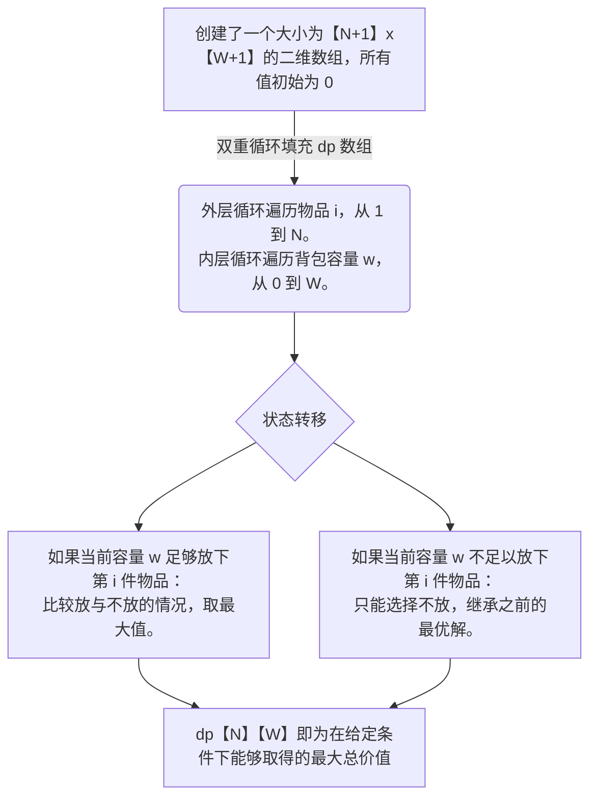

[下载链接](https://www.protodrive.xyz/assets/files/2024-09-03/1725361717-947809-dp.pdf)[upl-text-preview uuid=9fcb2ee9-debd-4794-88f1-b4ba9d0eeefa url=https://www.protodrive.xyz/assets/files/2024-09-03/1725361717-947809-dp.pdf has_snippet=false]dp.pdf[/upl-text-preview]
**强烈推荐直接下载pdf，体验完整版笔记效果**
# 动态规划(DP)
动态规划（Dynamic Programming，简称 DP）是一种通过将问题分解为更小的子问题，并通过记忆化存储子问题的解来提高效率的算法技术。它在求解最优问题、组合问题、计数问题等方面非常强大。下面，我将详细介绍动态规划的基本概念、使用方法和常见的解题套路模板。

## 动态规划的基本概念
### 子问题分解：

动态规划的核心思想是==将一个复杂的问题分解为更小的子问题，然后逐步解决这些子问题，最终解决原问题==。通常，这些子问题之间存在重叠，即不同的子问题可能会重复计算某些相同的子问题。

### 状态和状态转移：
- 状态：
动态规划中，我们使用状态来表示某个子问题的解。例如，在最长回文子串问题中，状态可以定义为`dp[i][j]`，表示子串`s[i:j+1]`是否为回文。
- 状态转移方程：
这是动态规划的核心，它描述了如何通过子问题的解来得到原问题的解。状态转移方程是基于问题的特性构建的。

### 初始状态和边界条件：
动态规划通常需要明确**初始状态**和**边界条件**，这些通常是问题中最简单、最小的子问题。
> 例如，对于一个空串或者单个字符的子串，直接可以确定其是否为回文。

### 优化：
如果问题具有最优子结构（Optimal Substructure），动态规划可以通过复用已经计算过的子问题结果来避免重复计算，从而显著提升效率。

## 动态规划的解题套路模板
在使用动态规划解决问题时，通常可以遵循以下几个步骤：

- 定义状态：明确需要计算的子问题是什么，并用一个数组或表格来表示这些子问题的解。
    >例如，定义 dp[i][j] 表示从第 i 个到第 j 个元素的子问题的解。
- 构建状态转移方程：找出子问题之间的关系，并写出状态转移方程。状态转移方程通常通过观察问题的规律或特性来构建。
    >例如，最长回文子串问题中的状态转移方程是：如果 s[i] == s[j] 并且 dp[i+1][j-1] 是回文，那么 dp[i][j] 也是回文。
- 初始化状态：根据问题的特点，初始化最小子问题的解。
    > 例如，在某些问题中，dp[0] 或 dp[i][i] 可能是初始状态。
- 迭代计算：按照状态转移方程，从初始状态开始迭代计算出所有子问题的解，直至得到问题的最终解。
- 返回结果：最后，根据已计算的子问题的解返回原问题的解。
## 经典例题与模板
> [!NOTE] 例题1：斐波那契数列
问题描述：求第 n 个斐波那契数。

- 状态定义：
    >设 dp[i] 表示第 i 个斐波那契数。
- 状态转移方程：
    >dp[i] = dp[i-1] + dp[i-2]
- 初始状态：
    >dp[0] = 0
    dp[1] = 1

::: tip 代码实现
```python
# --run--
def fibonacci(n):
    if n <= 1:
        return n
    dp = [0] * (n + 1)
    dp[1] = 1
    for i in range(2, n + 1):
        dp[i] = dp[i - 1] + dp[i - 2]
    return dp[n]
print(fibonacci(10))
```
:::

---
> [!NOTE] 例题2：0-1背包问题
问题描述：给定一个容量为 W 的背包和 N 件物品，每件物品有重量 w[i] 和价值 v[i]。求在不超过背包容量的情况下，能够获得的最大价值。
要求：从这 N 件物品中选择若干件物品装入背包，使得在不超过背包容量的情况下，总价值最大。
限制条件：每件物品只能选择 0 件或 1 件，不能拆分。（这也是“0-1”背包名称的由来）


### 解题步骤：

- + [ ] 定义状态（dp数组）。
- + [ ] 推导状态转移方程。
- + [ ] 初始化状态。
- + [ ] 按照状态转移方程填充dp数组。
- + [ ] 根据dp数组得到最终结果。

下面我们逐步详细解释每一步。

### 状态定义
| 变量 | 含义 |
| -- | -- |
| $dp[i][w]$ | 从前 i 件物品中选择，且背包容量为 w 时，能够取得的最大总价值 |
| $i$ |考虑的物品数量|
| $w$ |当前背包的容量|
i 的范围：i 从 0 到 N，表示考虑的物品数量。
>当 i = 0 时，表示没有物品可选，此时总价值为 0。

w 的范围：w 从 0 到 W，表示当前背包的容量。
>当 w = 0 时，背包没有容量，此时总价值为 0。

::: tip 为什么这样定义：

通过这种定义，我们将原问题分解为更小的子问题，即==在限定物品数量$i$和背包容量$w$的情况下，求最大价值==。
递归地考虑每件物品是否放入背包，可以逐步构建出整个问题的解。
:::
### 状态转移方程推导
1. 考虑第 i 件物品的选择
对于第 i 件物品（注意索引从 1 开始，为了与代码中的索引一致），在背包容量为 w 的情况下，我们有两种选择：

> 1. 不选择第 i 件物品。
> 2. 选择第 i 件物品。

我们需要在这两种选择中取最大值，以实现总价值最大化。

::: warning 情况 1：不选择第 i 件物品
状态转移：此时，问题转化为：在前 i-1 件物品中选择，背包容量仍为 w。
状态表示：$dp[i][w] = dp[i-1][w]$
:::
> [!IMPORTANT]解释：
>因为没有选择第 $i$ 件物品，背包容量和总价值都保持不变，只需要参考前 $i-1$ 件物品的最优解。

::: warning情况 2：选择第 i 件物品
前提条件：背包的当前容量 $w$ 必须大于等于第 $i$ 件物品的重量 $w[i]$，即 $w >= w[i]$。

状态转移：选择第 $i$ 件物品后，背包剩余容量为 $w - w[i]$。
状态表示：$dp[i][w] = dp[i-1][w - w[i]] + v[i]$

问题转化为：在前 i-1 件物品中选择，背包容量为 $w - w[i]$。
:::
> [!IMPORTANT] 解释：
>我们在前 i-1 件物品、剩余容量为$w - w[i]$的情况下，已经知道能取得的最大价值 $dp[i-1][w - w[i]]$。
选择第 i 件物品后，总价值增加了 $v[i]$。因此，总价值为 $dp[i-1][w - w[i]] + v[i]$。


::: tip 状态转移方程
综合两种情况，取最大值：
- 当 $w >= w[i]$ 时：
$$dp[i][w]=max(dp[i−1][w], dp[i−1][w−w[i]]+v[i])$$

- 当 $w < w[i]$ 时：
$$dp[i][w]=dp[i−1][w]$$
:::
> [!IMPORTANT]解释：
如果容量足够，我们比较`选择`和`不选择`第 i 件物品两种情况的总价值，取较大者。
如果容量不足，只能`不选择`第 i 件物品。

### 初始化状态
在填充 dp 数组之前，需要初始化一些已知值。

::: tip 初始化条件
$dp[0][w] = 0$：
>当没有物品可选时，无论背包容量是多少，总价值都为 0。

$dp[i][0] = 0$：
>当背包容量为 0 时，无论有多少物品可选，总价值都为 0。
:::

### 代码实现



---
> [!WARNING]举例说明
让我们通过一个具体的例子来理解上述过程。
背包容量：W = 5

- 物品列表：
|物品 | 重量 (w) | 价值 (v)|
|-|-|-|
|①|1|2|
|②|2|4|
|③|3|5|
|④|4|7|

:::: col

> [!TIP] 考虑第 1 件物品（重量 1，价值 2）
当容量 $w >= 1$ 时，可以选择放入：
> $$dp[1][1] = max(dp[0][1], dp[0][0] + 2) = max(0, 2) = 2$$
>
>对于更大的容量，同理：
>$$dp[1][2] = 2$$
>$$dp[1][3] = 2$$
>$$dp[1][4] = 2$$
>$$dp[1][5] = 2$$

::::
:::: col

> [!TIP] 考虑第 2 件物品（重量 2，价值 4）
当容量 w >= 2 时，可以选择放入：
>$$dp[2][2] = max(dp[1][2], dp[1][0] + 4) = max(2, 4) = 4$$
>$$dp[2][3] = max(dp[1][3], dp[1][1] + 4) = max(2, 6) = 6$$
>$$dp[2][4] = max(dp[1][4], dp[1][2] + 4) = max(2, 6) = 6$$
>$$dp[2][5] = max(dp[1][5], dp[1][3] + 4) = max(2, 6) = 6$$

::::
:::: col

> [!TIP] 考虑第 3 件物品（重量 3，价值 5）
当容量 $w >= 3$ 时，可以选择放入：
>$$dp[3][3] = max(dp[2][3], dp[2][0] + 5) = max(6, 5) = 6$$
>$$dp[3][4] = max(dp[2][4], dp[2][1] + 5) = max(6, 7) = 7$$
>$$dp[3][5] = max(dp[2][5], dp[2][2] + 5) = max(6, 9) = 9$$

::::
:::: col

> [!TIP] 考虑第 4 件物品（重量 4，价值 7）
当容量 $w >= 4$ 时，可以选择放入：
>$$dp[4][4] = max(dp[3][4], dp[3][0] + 7) = max(7, 7) = 7$$
>$$dp[4][5] = max(dp[3][5], dp[3][1] + 7) = max(9, 9) = 9$$
::::
:::: tip 最终结果
$dp[4][5] = 9$，即在容量为 5 的情况下，选择前 4 件物品能够获得的最大价值为 9。
::::

> [!NOTE]如何找出最优选择组合
通过回溯 dp 数组，可以找到具体选择了哪些物品：
>>$dp[4][5] = 9，与 dp[3][5] = 9$ 相等，说明第 4 件物品没有选择。
$dp[3][5] = 9，与 dp[2][2] + v[3] = 4 + 5 = 9$ 相等，说明第 3 件物品被选择。
$dp[2][2] = 4，与 dp[1][0] + v[2] = 0 + 4 = 4$ 相等，说明第 2 件物品被选择。
$dp[1][0] = 0$，说明第 1 件物品没有选择。

::: warning 最终选择：

第 2 件物品（重量 2，价值 4）
第 3 件物品（重量 3，价值 5）
总重量：2 + 3 = 5，符合背包容量限制。
总价值：4 + 5 = 9，即为最优解。
:::

::: tip 代码实现
```python
# --run--
def knapsack(W, weights, values):
    n = len(weights)
    dp = [[0] * (W + 1) for _ in range(n + 1)]
    
    for i in range(1, n + 1):
        for w in range(W + 1):
            dp[i][w] = dp[i - 1][w]
            if w >= weights[i - 1]:
                dp[i][w] = max(dp[i][w], dp[i - 1][w - weights[i - 1]] + values[i - 1])
    
    return dp[n][W]
print(knapsack(5, [1,2,3,4], [2,4,5,7]))
```
:::

## 实战

::: warning 最长的回文子串 
[力扣题目链接](https://leetcode.cn/problems/longest-palindromic-substring/)
给你一个字符串 s，找到 s 中最长的回文子串。

示例 1：
* 输入：s = "babad"
* 输出："bab"
* 解释："aba" 同样是符合题意的答案。

示例 2：
* 输入：s = "cbbd"
* 输出："bb"

示例 3：
* 输入：s = "a"
* 输出："a"

示例 4：
* 输入：s = "ac"
* 输出："a"
:::

> [!TIP]子问题重叠：
回文子串问题具有子问题重叠的特性，即较大问题的解可以通过较小问题的解来构建。

> [!IMPORTANT]例如
> 如果我们知道子串 s[i+1:j-1] 是回文，那么只要 s[i] == s[j]，我们就可以确定子串 s[i:j+1] 也是回文。
> 因此，我们可以通过递归地解决较小的子问题，从而构建较大的问题的解。

避免重复计算：通过使用动态规划，我们可以记录子串的回文状态，这样在计算新子串时，可以直接使用已经计算过的结果，避免重复计算。这显著提高了算法的效率。

### DP表格初始化：

创建一个二维数组 dp，其中 dp[i][j] 表示子串 s[i:j+1] 是否是回文。
数组初始化为 False。

### 填充DP表格：

通过两层循环填充 dp 表格。
外层循环从字符串的末尾开始，内层循环从当前字符 i 开始，逐步向后遍历字符串。
如果 s[i] == s[j] 并且 s[i+1:j-1] 是回文（即 dp[i+1][j-1] 为 True），则 dp[i][j] 为 True，表示子串 s[i:j+1] 是回文。

### 更新最长回文子串：

在填充 dp 表格的过程中，如果发现一个新的更长的回文子串（即 dp[i][j] 为 True 并且子串长度大于当前已知的最长回文长度），就更新记录最长回文子串的起始位置和长度。
### 返回结果：
最后，根据记录的起始位置和长度返回最长的回文子串。

```python
# --run--
def longestPalindrome(s):
    n = len(s)
    dp = [[False] * n for _ in range(n)]
    max_length = 0
    start = 0
    
    # Fill the dp table
    for i in range(n - 1, -1, -1):
        for j in range(i, n):
            if s[i] == s[j]:
                if j - i <= 1 or dp[i + 1][j - 1]:
                    dp[i][j] = True
            if dp[i][j] and j - i + 1 > max_length:
                max_length = j - i + 1
                start = i
    
    return s[start:start + max_length]
print(longestPalindrome("abab"))

```

## 总结
动态规划问题的核心在于：
- 状态定义清晰，明确 dp 数组每个元素的含义。
- 状态转移方程准确，全面考虑每种可能的选择，保证能够找到全局最优解。
- 初始化正确，确保 dp 数组的初始状态为后续计算提供正确的基础。
- 通过迭代填充 dp 数组，逐步解决子问题，最终得到原问题的最优解。

掌握动态规划的方法需要多加练习，多思考每个状态和转移的意义。通过不断练习不同类型的动态规划问题，您会逐渐熟悉并灵活运用这种强大的算法思想。动态规划是解决一类具有重叠子问题和最优子结构特性的最优问题的有效方法。掌握动态规划的核心在于理解如何定义状态、构建状态转移方程，并逐步优化解决问题。通过练习，动态规划将成为解决复杂问题的利器。
