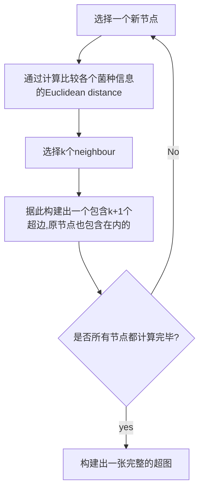

# 1.情绪识别EEGFuseNet

| 论文名称 |EEG classification algorithm of motor imagery based on CNN-Transformer fusion network |
| -------- | -------- | 
| 期刊 |IEEE TRANSACTIONS ON NEURAL SYSTEMS AND REHABILIT A TION ENGINEERING|
| 方法 |本文提出了一种实用的基于混合无监督深度卷积递归生成对抗网络的脑电特征表征与融合模型，称为EEGFuseNet。EEGFuseNet以无监督的方式进行训练，覆盖空间和时间动态的深度脑电图特征被自动识别。|
| 结论 |证明了以纯无监督的方式实现基于脑电的跨主体情绪识别的可能性。|
| 评价 |EEGFuseNet作为一个无监督模型，具有良好的跨主体情感识别性能。|

---
## 主要工作

### EEGFuseNet
提出了一种高效的**深度编码器-解码器混合网络结构**来表征非平稳时间序列脑电信号。有效地**融合了时空动力学的联合信息，刻画了有用但潜在的时空动力学信息**。该混合网络通过融合CNN、递归神经网络(RNN)、生成对抗网络(GAN)

以一种智能混合的方式融合不同来源的特征信息。具体而言，
- 在`CNN`从原始脑电图信号中提取特征的基础上
- 采用`RNN`通过探索时间邻接处潜在的特征关系来增强特征表示
- 为了提高训练性能，引入`GAN`以无监督的方式通过动态更新来改进`CNN-RNN`网络的训练过程

这可能有利于高质量的特征生成。提取的深度特征可以表征通道间的空间关系和相邻时间点信号的依赖关系。
### 超图解码模型
[什么是超图](#什么是超图)

建立了统一的基于无监督`EEGFuseNet`的==超图解码框架==，并验证了该框架在解决脑解码应用中的可行性和有效性。
本文根据超图构造中的**特征深度特征**来衡量样本关系，其中**共享相似属性**的脑电图样本由超边缘连接

::: tip 为啥用超边缘连接
超边缘可以更灵活地描述群体关系。
:::
遵循超图划分规则，然后对**超图的拉普拉斯式**进行计算和优化.
- 其中共享相似属性的超边之间的连接被分组到一个集群中
- 而共享不同属性的超边之间的连接被分组到不同的集群中。

---
## 设计初衷
### 如何有效地融合在不同大脑位置和不同时间点采集的脑电图信号
::: tip 空间信息融合
基于**给定的时间点**，融合**不同脑区**关系层面的脑电图信号(如相关性)。通过
- 评估皮层区域之间的相互作用功能
- 测量相互作用的方向和强度
来解释皮层区域的交流行为。
:::
::: tip 时间信息融合
在**特定的大脑区域或脑电电极**上，通过计算**时域特征**(如统计模式和形状信息)、**频域特征**(如功率谱特征)或时频特征
- 将连续的时间序列脑电图信号截断为短数据段
- 融合不同时间点的脑电图样本。

两个著名的例子是==短时傅里叶变换==(STFT)和==小波分析==，它们都是通过逐次计算和测量数据在时间上的相互作用来计算数据的时频动态。这种融合适用于在特定电极上的时间、频率或时频域的常用脑电图特征。
:::
::: tip 空间和时间信息的融合
目前，许多研究尝试采用时序方法来表征时间信息和空间信息，
- 从每个电极上的脑电图数据来表征时间信息
- 根据每个电极上表征的时间信息来衡量任意两个电极之间或一组电极之间的关系来表征空间信息

虽然可以估计空间特征和时间特征，但这种方法受限于**预先定义的时空信息顺序关系**，不能有效地**从时空联合域中提取和融合有用但潜在**的信息。
:::
### 无监督学习
::: tip 为什么选择无监督学习作为研究方向
目前大部分研究都是基于监督学习的，这就需要**大量的带有情感标签的训练样本**，尤其是对于深度网络。例如，**训练样本的规模越小，深度网络就会因为过拟合问题而不能很好地泛化**。网络设计和样本量都会对网络性能产生显著影响。
- 在现实的应用场景中，从不同的参与者那里收集大量的脑电图信号，并手动为每个样本标注情绪标签是**不现实**的。
- 在示例注释过程中还存在诱发“**标签噪声**”的风险。

无监督学习可以提供一种更自然的方法来解码脑电图信号，并与人类学习机制更一致，需要从可用的样本中获得有用的信息，而不需要任何相关的指导。
:::
结果表明，所提出的无监督框架具有良好的泛化性，较好地解决了跨学科任务中的个体差异问题。无论现有的深度无监督脑电网络是怎样的，据我们所知，目前还没有对混合深度构型以融合无监督的方式将高维脑电信号转换为低维有效可靠的特征表示进行过扎实而深入的研究。

---
## EEGFuseNet具体思路

(1)如何从经典的`CNN`结构提出`EEGFuseNet`的基本架构，
(2)如何将`GAN`融合到基于`CNN`的网络中以生成高质量的特征，
(3)如何将`RNN`融合到基于`CNN-GAN`的网络中以更好地融合时空信息
## CNN
### 编码器-解码器架构
在典型的基于CNN的深度`编码器-解码器`网络中, 编码器进行卷积和下采样，解码器进行反卷积和上采样，重构输入EEG信号。
- 编码器由**卷积层**组成，用于从给定的输入X中提取有用的信息，并将其转换为单维向量(隐藏向量)
- 解码器由**反卷积层**组成，用于对编码器特征图进行拓展，并将隐藏向量转换为生成的输出(Y)。

- 通过**最大化X和Y之间的相似性** 等价于 **最小化给定的均方误差MSE损失函数**$L ( X , Y ) = | | X - Y | | _ { 2 } ^ { 2 }$，联合训练自编码器结构，并将学习到的隐藏向量作为X的信息化潜在特征表示，用于进一步的数据分析和建模。
::: tip 优势
值得注意的是，该自编码器架构是一种**自学习范式**，在训练过程中**不需要任何标记信息**，与其他常见的特征提取架构相比，训练起来明显**更容易**。因此，它适用于解决标签缺失的小体积脑电数据的问题。
:::
### 编码器设计思路

#### 卷积层
受`EEGNet`结构的启发，利用连续的**二维卷积层**生成覆盖不同频段脑电图空间信息的特征映射，其中**卷积核长度为输入数据采样率的一半**。值得注意的是，由于输入的EEG信号由通道和时间点组成$X \in R^{C×T}$，这里采用二维卷积函数，而不是一维卷积函数。
::: tip EEGNet中对卷积核长度的解释
256Hz,选用128的长度可以捕获2Hz及以上的频率信息。
:::
多卷积层的主要优点包括:
- 从不同的维度对脑电信号进行紧凑、全面和完整的表征;
- 以最优方法探索提取的特征映射与特征融合之间的关系;
- 参数较少，适合分采样层的实现。
#### BN层
采用`Batch归一化`(BN)方法对每个训练小Batch进行**归一化处理**，通过减少内部协变量偏移来加快网络训练过程。
#### ELU层
在卷积层和反卷积层中加入**指数线性单元(ELU)激活函数**，改进模型拟合。

#### 功能
可以从不同大脑位置采集的时序脑电图信号中**学习时空动态**，并将样本点**集成到一个紧凑而深入的特征表示向量**，该向量已被证明有助于准确、高效的数据描述。该网络可为无监督深度特征表征和融合提供基础。训练过程中的**权重是随机初始化**的。

## 混合CNN-GAN
::: tip 为什么要使用GAN
传统的`编码器-解码器网络`易于训练，但生成的特征质量较低。许多研究已经证明**GAN**能够从顺序数据**生成高质量的特征**。
:::

::: tip 鉴别器?鉴别啥?
鉴别器是对输入的脑电信号是由**生成器产生的伪脑信号**以及从人脑中采集到的**真实脑信号**进行**区分**。
:::
::: tip 生成器?生成啥?
生成器生成**判别器无法判别的信号**, 但是生成器的目的就像`枯叶蝶`一样,他并不是要变成一片树叶,而是要骗过捕食者,也就是判别器

:::
为了进一步了解非平稳时序脑电图数据的复杂结构，我们进一步开发了一种**基于CNN-GAN的混合深度编码器-解码器网络**。

|符号|含义|
|--|--|
|$G$|生成器|
|$D$|鉴别器|

### 目标函数
训练过程中的**目标函数**是建立一个好的`D`，能够从生成的假样本中区分出真实的样本，同时开发一个好的`G`，能够产生一个尽可能与真实样本相似的假样本`双人极大极小博弈`。在训练过程中，判别器的输入是X和G(X)。目标函数为
$$L_{Gan} ( G , D ) = E_X [ \log D ( X ) ] + E_x \log [ 1 - D ( G ( X ) ) ]$$
$$L _ { 1 } ( G ) = | | X - G ( X ) ) | | _ { 2 } ^ { 2 }$$

|符号|含义|
|--|--|
|$\log D ( X )$|真实样本X的鉴别器输出|
|$D(G(X))$|假样本的鉴别器输出|

混合CNN-GAN网络的总体目标函数为
$$L = \operatorname { a r g}{ m i n } _ { G } max_D ( L _ { G A N } ( G _ { A } D ) + \lambda L _ { 1 } ( G ) )$$

::: warning 汇报任务:
- 解释L1
- 指出原文与GAN描述不同的地方
:::

## 混合CNN-RNN-GAN (EEGFuseNet)
根据脑电信号的性质，提取的特征在不同时间点之间应该具有复杂的依赖关系。

我们将基于CNN-GAN的网络扩展到一种混合架构，并利用循环网络和卷积网络的优势提取脑电图特征。如图2所示，编码器由卷积层组成，卷积层在每个时间点对脑电图信号进行特征提取(浅特征提取)，循环层将每个时间点提取的特征编码为整个输入脑电图信号的整个特征表示(深特征提取)。解码器由循环层和反卷积层组成，从编码器输出信号预测每个时间点的特征，并将特征重构为原始脑电信号。在脑电处理过程中，采用一种有效的融合方法，从时间-空间联合域表征了包含空间和时间动态的信息特征。

在混合的基于CNN- rnn - gan的网络中，浅层特征提取中的卷积和反卷积层与设计的基于CNN的网络相同(图1)。在浅层特征提取部分，根据生成的特征图(行和列指的是来自通道和时间点的特征)，在深层特征提取部分对序列特征进行表征。在循环层(RNN网络)中，学习相邻空间依赖关系的基本构建模块是LSTM单元。由于LSTM的复杂训练，我们提出了一种类似于LSTM的GRU[36]，它可以在不分离记忆单元的情况下调节门控单元内的提示流。很明显，在机器学习任务上，GRU表现出了与LSTM相当的性能，需要的参数更少，[37]。为了获得更高的计算效率，我们在实现中采用了双向GRU，定义为

|符号|含义|
|--|--|
|xt (t∈[1,t])|输入|
|ht (t∈[1,t])|输出|
|T|是数据的总长度|
|W (z)， W (r)， W (h)， U (z)， U (r)， and U (h)|是权重矩阵|
|b(z)， b(r)， b(h)|是在训练过程中学习到的偏差|
|Zt|更新门向量|
|rt|复位门向量|
|ˆht|隐态向量|
|σ| 正函数|
|φ|正函数|

是一个元素级的乘法。在实现过程中，前向和后向循环层对序列中基于时间点的特征向量进行迭代运算，并计算出相应的隐藏状态向量的前向和后向序列。具体来说，数据{x1, x2，…， xT}分别按前向和后向顺序输入到双向GRU。这里，前向和后向GRU的隐藏层记为[h f 1, h f 2，…]和[hb1, hb2，…]， hb T]。前向和后向GRU在t时刻的输出分别为

双向GRU在t点的输出为at = h f t⊕hbt，其中⊕表示向量拼接。

最后，生成的深度特征表示向量o表示为o = (a1，…)，在……， aT)，获取序列特征信息。为了实现脑电特征表征和融合，输入的脑电信号经过卷积层后，首先被表征为每个时间点t的一组特征向量序列(被认为是空间动态表征)，然后由循环层学习序列特征，合成时间序列脑电信号的过去和未来动态信息(被认为是时间动态表征)。因此，提取的o作为深度脑电特征，用于后续的无监督脑电解码，可以跨时间点表示整个输入脑电信号，不仅包括脑电特征，还包括序列信息中的脑电特征。为了提高实现效率，我们在训练过程中分批次更新GRU的输入，其中一批包括在一定时间间隔内连续的脑电信号。该结构成功地融合了提取的不同深度、不同位置、不同时间点的特征表示，有利于非平稳时间序列脑电图信号的时空动态表征。
## 补充
### 什么是超图
简单来说，我们所熟悉的图而言，它的一条边（edge）只能连接两个顶点（vertice）；而超图，人们定义它的一条边（hyperedge）可以和任意个数的顶点连接。图与超图的对比示意图如下：

在超图里，我们抽象出一种新的边：==超边==（hyperedge）。超边可以做到同时连接>2个点，如下图所示：

|符号|含义|
|--|--|
|$v_1,v_2...v_7$|代表七个节点|
|$e_1,e_2,e_3$|代表了三条超边(hyperedge)也就是图中的三个椭圆|

以`KNN超图`举例,假设图中每个节点都是一个菌种，每个节点$v_i$的赋值内容则是一个包含有菌种各种信息的向量。

总的来说，**超图的建立是基于超边的建立，而超边的建立则是基于我们对节点之间关系的先验条件来实现的**。
