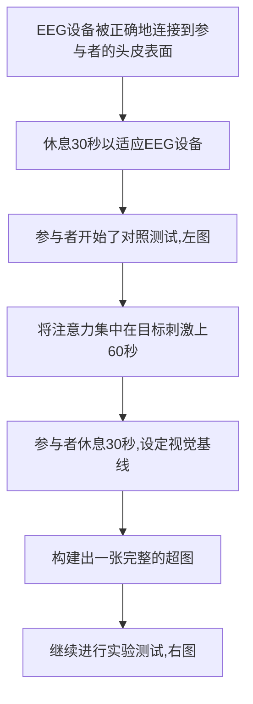

# 2.注意力水平分类CAMNN

| 论文名称 |Electroencephalogram-Based Attention Level Classification Using Convolution Attention Memory Neural Network|
| -------- | -------- | 
| 期刊 |IEEE ACESS|
| 方法 |使用具有卷积块、注意机制、长短时记忆和全连接神经网络的向量到向量（Vec2Vec）建模来学习原始EEG信号的高级特征并执行分类。|
| 结论 |结果表明，我们的模型可以达到92%的准确率和0.92的F1分数，这优于几种现有的神经网络模型，如递归神经网络（RNN）、长期短期记忆（LSTM）和卷积神经网络（CNN）、卷积神经网深度学习（深度卷积网络）和基于EEG的BCI紧凑卷积网络（EEGNet）。|
| 评价 ||

---

::: tip 检测注意力水平的重要性
注意力被定义为在学习和记忆环境中关注关键信息的认知过程。专注是很重要的，因为它将有益于学习体验，并可能有助于积极的学习成果。大多数职业，如教师、操作员、医生和司机，需要高度的专注，才能高效地完成工作。
:::

## 主要工作

使用具有`卷积块`、`注意机制`、`长短时记忆`和`全连接神经网络`的**向量到向量**（Vec2Vec）建模来学习原始EEG信号的高级特征并执行分类。

这项研究的大体分为三个步骤:
- 通过分析脑电图信号来观察`Troxler`衰落实验期间的大脑活动。
- 提出一种具有**Vec2Vec建模**的深度学习模型，该模型可以通过神经网络以端到端的方式进行学习。
- 证明提出的模型在**准确性**、**准确性**、**召回率**、**特异性**和**F1-Score**方面优于其他深度学习模型。

## 实验
- 如果他们的视线**正确地固定在刺激物上**，中心点的外围区域（模糊紫色圆圈）将**逐渐消失**，表明参与者表现出专注行为。
- 其中包括红色颗粒作为**干扰因素**。这些粒子将在场景中**随机移动**，导致参与者失去对目标刺激的关注，从而表现出注意力不集中的行为。

创建了一个带有“**开始按钮**”的简单图形用户界面，用于在参与者单击按钮时同时触发EEG耳机和网络摄像头。EEG耳机和网络摄像头用于不同的目的。

::: tip 如何记录正确的EEG信号
该实验由网络摄像头监控，以跟踪参与者的视线。通过网络摄像头**进行眼睛跟踪**是为了确保收集的EEG数据有助于满足实验目标。将**绘制热图**，以查看参与者眼睛在屏幕上的位置。

**例如**: 如果在控制测试期间发现参与者的眼睛**没有正确固定**在目标刺激上，则该测试的原始EEG数据将**不会被保留**。
:::

## 仪器
### EMOTIV Insight无线耳机
用于记录参与者的EEG信号。该装置有5个电极通道，分别为`AF3`、`AF4`、`Pz`、`T7`和`T8`。由于我们的研究是关于注意力分析，因此仅使用
- **额叶皮层AF3和AF4**
- **顶叶皮层Pz**

对于EEG信号的采样频率，该设备可以记录高达`128Hz`的信号，这意味着可以在一秒钟内采集128个时间点。由于每个测试样本的持续时间为60秒，因此将有7680个时间点。

### 网络摄像头 
#### 配置
基于网络摄像头的眼睛跟踪，它是一种适用于记录参与者眼睛注视数据的摄像机。网络摄像头的分辨率为1920×1080（全高清），每秒30帧。
#### 眼睛跟踪算法的流程图

- 在实验开始时，将对每个参与者的眼睛进行简单的校准。在校准过程中，参与者将注视屏幕上的几个点。
- 在我们的研究中，注视方向是一个指标显示一个人眼睛的空间焦点，无论是从左到右，还是从右到右，而注视数据是屏幕上的一组XY坐标，显示眼睛注视的位置。

下图显示了使用眼睛跟踪算法通过网络摄像头跟踪眼睛（绿色圆圈）。

## 眼动数据可视化
为了跟踪参与者在测试期间的表现，使用热图来可视化感兴趣区域的眼球运动。热图是一个有用的数据分析软件，它使用视线数据作为输入，并**将热到冷的颜色光谱应用于受到关注的区域**。为了构造热图，使用了二维高斯函数。图显示了椭圆高斯函数的曲线。

二维高斯分布的数学计算:
$$ f(x, y)=\frac{1}{2 \pi \sigma^{2}} e^{-\frac{\left(x-\mu_{x}\right)^{2}+\left(y-\mu_{y}\right)^{2}}{2 \sigma^{2}}} $$
其中x和y是眼睛位置的屏幕坐标，σ是高斯函数的标准偏差，µx，µy是x和y坐标的平均值。

|符号|含义|
|--|--|
|$x,y$|眼睛位置的屏幕坐标|
|$σ$|高斯函数的标准偏差|
|$µ_x$|x坐标的平均值|
|$µ_y$|y坐标的平均值|

## 卷积注意记忆神经网络(CAMNN,CONVOLUTION ATTENTION MEMORY NEURAL NETWORK)
为了有效地从脑电信号中提取特征并将这些信号分类为注意或不注意行为，提出了一种称为卷积注意记忆神经网络（CAMNN）的深度学习模型。

Vec2Vec分为4个部分，即

|层|方法|
|--|--|
|编码器|ResNet34|
|注意层|soft attention|
|解码器|LSTM|
|全连接层|是具有一个隐藏层的网络|

## 编码器ResNet34

ResNet34的最大优点是它可以增加网络模型的深度和精度，同时避免负面结果。ResNet34的输入EEG信号使用单个输入信道

显示了ResNet34的参数，如内核大小、填充、步幅和输出大小。这些参数将被插入到操作中，该操作由卷积块、具有标识快捷方式的卷积层和具有投影快捷方式的卷积层组成。

卷积块是特征学习，它由
- 卷积层
- 批量归一化BatchNorm
- 非线性激活函数RELU
- 池化层

二维卷积由64个核组成，其中所有EEG信号将在训练过程中学习。这些内核将在输入图像矩阵上逐列水平跨步，以识别64个特征映射。

之后，这些特征映射将被输入到批量标准化（BN）中，以实现更高的学习率，从而加快训练过程。
批量标准化BN的公式:
$$ \begin{aligned} \mu_{B} &=\frac{1}{m} \sum_{i=1}^{m} x_{i} \\ \sigma_{B}^{2} &=\frac{1}{m} \sum_{i=1}^{m}\left(x_{i}-\mu_{B}\right)^{2} \\ \hat{x}_{i} &=\frac{x_{i}-\mu_{B}}{\sqrt{\sigma_{B}^{2}+\epsilon}} \\ y_{i} &=B N_{\gamma, \beta}\left(x_{i}\right) \end{aligned} $$
其中m是批次大小，x是激活值，µB是小批次平均值，σ2B是小批量方差，ˆxi是归一化激活，∈ 是方差变为零时使用的噪声参数，yi是可学习的尺度和移位参数。
## 注意层soft attention

该机制将使用卷积特征$（f_1、f_2、…、f_k）$和隐藏状态$h_{k−1}$ 作为输入来计算将用于解码器的加权注释向量。$h_{k−1}$是LSTM单元的输出，其用作存储输出数据信息的神经网络存储器。$f_k$和$h_k$的合计值:
$$ \begin{aligned} x_{k} &=f_{k}+h_{k-1} \\ r_{k}\left(x_{k}\right) &=\left\{\begin{array}{ll}0 & \text { for } x_{k}<0 \\ x_{k} & \text { for } x_{k} \geq 0\end{array}\right.\end{aligned} $$
其中xk是时间步骤k处的卷积特征和隐藏状态的和，rk（xk）是ReLu层之后的聚合值。接下来，如等式11所示的softmax函数用于计算聚合值S（rk）的关注权重。
$$ S\left(r_{k}\right)=\frac{e^{r_{k}}}{\sum_{k} e^{r_{k}}} $$
最后，可以使用等式12计算注意力加权注释向量Wk。Wk表示根据隐藏状态的每个特征的相关信息。
$$ W_{k}=\sum_{k} S_{k} f_{k} $$
## 解码器LSTM

## 全连接层
具有一个隐藏层的完全连接网络用于获取解码器的输出，将其展平为单个值向量，并计算每个标签的概率（注意或不注意行为）。在每个层之后执行0.5的dropout。使用dropout是为了防止训练数据的过度拟合
## 完整结构

## 结果
### 热图

### 精度
$$\begin{aligned} \text { Accuracy } &=\frac{T P+T N}{T P+F N+T N+F P} \times 100 \% \\ \text { Precision } &=\frac{T P}{T P+F P} \\ \text { Recall } &=\frac{T P}{T P+F N} \\ \text { Specificity } &=\frac{T N}{T N+F P} \\ F 1 &=\frac{2 * \text { Precision } * \text { Recall }}{\text { Precision }+\text { Recall }} \end{aligned} $$

由于CAMN具有最高的精度和召回率，F1分数无疑具有最高值0.92，其次是深度ConvNets（0.8）、CNN（0.76）、EEGNet（0.75）、LSTM（0.67）和RNN（0.52）。较高的F1分数表明模型在数据集上具有较高的准确性。
## 补充
### soft attention

