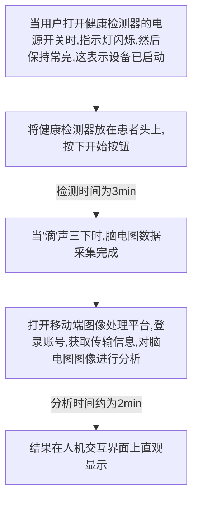

# 1.情绪分类Res50
| ||
| -------- | -------- | 
| $论文名称$ |ResNet-50 based technique for EEG image characterization due to varying environmental stimuli |
| $作者$ | Tingyi Tian |
| $机构$ | School of Art and Design, Shanghai University of Engineering Science, Shanghai, China |
| $期刊$ |Computer Methods and Programs in Biomedicine 7.027/Q1|
| $类别$ | 情绪分类 |
| $方法$ |采集61个真实环境场景图像，根据环境的视觉特征分为三类。招募了8名志愿者，共收集了488个脑电图图像数据。利用训练好的ResNet-50模型对采集到的脑电图图像进行特征自动分析和情绪分类。将该模型与支持向量机(SVM)、传递分量分析(TCA)、动态图卷积神经网络(DGCNN)和DAN方法进行了比较。|
| $结论$ |本研究训练的ResNet-50模型准确率为85.1 1%，方差为7.91。通过对环境刺激诱发的脑电图图像的验证，与模型训练结果相比，结果提高了2.01%，方差减小了0.04。该模型在识别消极情绪和中性情绪方面更准确|
| $评价$ |文章采用大量数据集结合ResNet50达到更好的效果|

---
## 情绪分类
对于情感识别，额叶和顶叶被认为是最相关的。
::: tip 二维度模型
`Valence` 一个人的情绪是积极的还是消极的
`Arousal` 情绪的强度是多少，从非常平静到非常兴奋

:::
## 创新点
### ResNet-50
随着模型层数的增加，计算资源的消耗变得非常大，并出现“梯度消失”问题。ResNet-50的优点是它解决了梯度消失的问题

### 人机交互健康监控器
基于情感识别的人机交互健康监测器主要由采集模块(金属板电极)、控制模块、存储模块、传输模块和人机交互模块组成。

### 真实场景实验
共收集了61个环境场景，并将其分为三类。
- 第一类是城市公园和绿地的场景，场景中有雕塑可以作为视觉焦点
- 第二类主要由绿色植物组成
- 第三类主要包括城市建筑和道路。

## 主要工作
- 本研究采用的ResNet-50模型能够自动提取脑电信号特征，减少数据预处理的人工步骤，更快速、方便地实现情绪识别
- 本研究设计的BCI设备还具有便携式，高性价比和低功耗的特点，这使得它适合日常使用。
- 面对长期受负面情绪影响的不良健康用户，可以建立个人用户数据库，改进学习模型的训练。
- 检测还会根据用户的使用时间、使用频率和数据分析，充分了解用户的想法，进而进行更好的人机交互。

### 实验流程与数据集
|数据集名称|机构|下载地址|
|-|-|-|
|SEED|上海交通大学BCMI实验室|http://bcmi.sjtu.edu.cn/~seed/seed.html|

SEED是由上海交通大学BCMI实验室收集的情绪脑电信号数据集。该数据集包含了来自15个实验对象的62通道脑电图信号。研究人员准备了15部时长约为4分钟的电影。这些电影被分为三种情感类型。

|||
|-|-|
|消极|是自然灾害和人为灾难的悲剧电影，以模拟主体的消极情绪，如悲伤|
|中性|是世界遗产纪录片，不应该刺激主题的积极或消极情绪|
|积极|一种以激发主体的快乐和其他积极情绪为目的的喜剧片|

研究对象被要求观看这些电影片段。在播放完每个片段后，受试者有45秒的时间来评估自己的情绪并冷静下来。SEED提供的脑电图数据由62通道脑电图数据组成。每个受试者都参加了三轮实验，每轮实验间隔一到两周。整个数据集包括45个实验数据。数据集采样频率为512Hz，下采样到200hz，通过带通滤波保留0 - 75hz的数据。
| ||
|-|-|
|被试数量|15|
|数据集采样频率|512 Hz|
|滤波频率|0 Hz~75 Hz|
|通道数量|62个通道信号|
|基电极|AFz|

### 数据预处理

### 特征提取
在SEED中，将微分熵(DE)、功率谱密度(PSD)、自动存储管理(ASM)、微分不对称性(DASM)和理性不对称性(RASM)特征用于跨受试者情绪识别任务。采用短时傅里叶变换和非重叠汉明窗(1s)计算脑电图数据的DE特征，并在5个频段上进行平均。DE的公式是

$$\begin{aligned} & h(X)=-\int_{-\infty}^{\infty} \frac{1}{\sqrt{2 \pi \sigma^2}} e^{-\frac{-(x-\mu)^2}{2 \sigma^2}} \log \left(\frac{1}{\sqrt{2 \pi \sigma^2}} e^{-\frac{(x-\mu)^2}{2 \sigma^2}}\right) d x \\ &=\frac{1}{2} \log \left(2 \pi e \sigma^2\right) \end{aligned}$$
结果表明，DE的分类结果显著优于其他特征，这与前人的研究基本一致。
### 特征分类

### 训练
#### 数据标准化
了提高模型的准确性，在训练模型之前，先去除与情绪无关的因素。采用窗口长度为20 s的线性动态系统(LDS)方法平滑特征序列，数据维数为62 × N × 5。在以往的研究中也应用了这种处理方法，并取得了较好的效果。本研究将N统一设为180，共获得675组LDS样本数据。在模型训练中，所有数据按8:2的比例随机分配，即获得540个训练集和135个测试集。采用极大极小标准化方法对数据进行统一处理;其公式如下:

$$y_i= \frac{x_1-\min \left\{x_1, x_2, x_3, \ldots, x_n\right\}}{\max \left\{x_1, x_2, x_3, \ldots, x_n\right\}-\min \left\{x_1, x_2, x_3, \ldots, x_n\right\}}$$
#### 训练参数

| ||
|-|-|
|优化器|Adam|
|学习率|0.001|
|batch大小|5|
|epoch轮数|50|
|模型精度|81.21%|
|标准差|7.91%|

较高的值往往表明积极的情绪;较低的值往往表明消极情绪;中间值倾向于表明中性的情绪。

### 特制BCI设备
#### 介绍
该BCI设备是一种可折叠的便携式情绪检测设备。折叠时，装置体积小，便于携带，可用于日常生活。这种材料是软塑料，可以保护金属板电极，并适合用户的头部。使用时，打开带金属板电极的脑帽，戴在头上。脑电图图像采集完成后，存储在存储卡中，通过有线或无线方式传输到图像处理平台。

#### 使用方法

## 结果

### 神经生物学
通过模型训练，得到特征的脑电地形图：
- 积极情绪时权重较大的电极为FZ、FC1、CZ、PZ和F8。激活的电极主要分布在大脑顶叶，额叶也有一定程度的激活。
- 中性情绪时权重较大的电极为FPZ、F3、FT7、C2和P5。激活电极分布相对分散，额叶有明显激活。
- 负性情绪权重较大的电极为FC5、CP1、PO3、O1和P6，激活电极位于大脑枕叶。这与其他论文的相关研究结果是一致的。

工作场所和生活环境对人们的心理健康和心理幸福感有很大的影响。环境中的绿色植物场景对精神分裂症患者有积极作用，优美的环境场景对儿童和老年患者的疾病康复有促进作用。居住环境是直接影响居民情绪的重要因素。因此，识别人对环境的反应情绪具有重要意义
### 模型对比

本文采用的ResNet-50的平均精度为85.11%，方差为7.91。在SEED中，DAN的平均准确率比ResNet-50低1.3%，方差比ResNet-50高0.65，说明ResNet-50在执行情绪识别任务时具有较好的稳定性。

---
$\begin{aligned} & h(X)=-\int_{-\infty}^{\infty} \frac{1}{\sqrt{2 \pi \sigma^2}} e^{-\frac{-(x-\mu)^2}{2 \sigma^2}} \log \left(\frac{1}{\sqrt{2 \pi \sigma^2}} e^{-\frac{(x-\mu)^2}{2 \sigma^2}}\right) d x \\ &=\frac{1}{2} \log \left(2 \pi e \sigma^2\right) \\ & y_i= \frac{x_1-\min \left\{x_1, x_2, x_3, \ldots, x_n\right\}}{\max \left\{x_1, x_2, x_3, \ldots, x_n\right\}-\min \left\{x_1, x_2, x_3, \ldots, x_n\right\}} \\ & Z_c=\frac{1}{H \times W} \sum_{i=1}^H \sum_{j=1}^W u_c(i, j) \\ & s=\sigma\left[\omega_2 \delta\left(\omega_1 z\right)\right]\end{aligned}$

